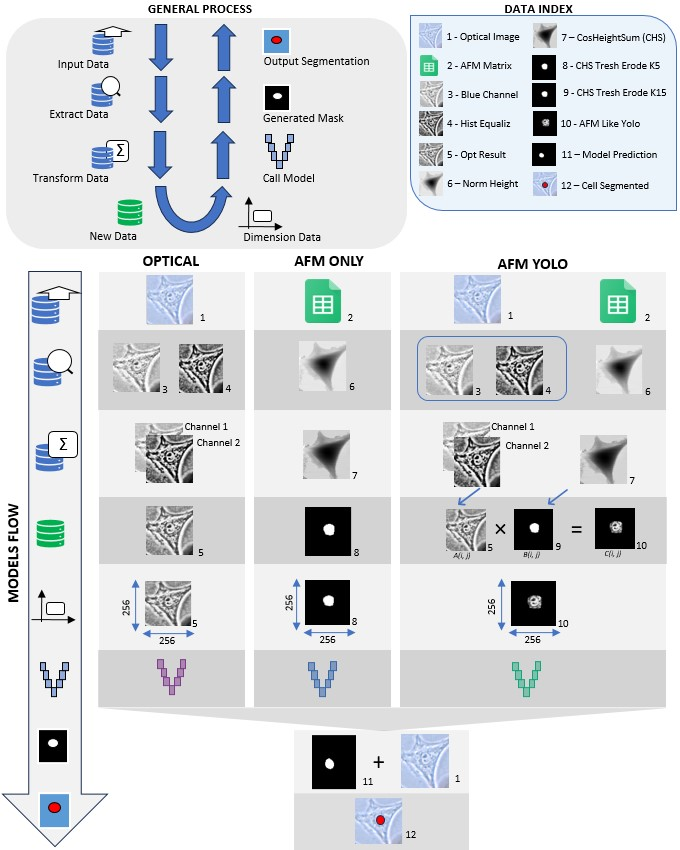

# UNet_AFM: Cellular Structure Segmentation using U-Net and Atomic Force Microscopy

This repository contains the code and models for a project focused on segmenting cellular structures, specifically nuclei, using data derived from Atomic Force Microscopy (AFM), optionally combined with optical microscopy images. The core segmentation model is based on the U-Net architecture.


*Figure: Overview of the data preprocessing and model application workflow.*

## ✨ Features

*   **AFM Data Processing:** Scripts to process raw AFM data (`.csv` files).
*   **Optical Image Integration:** Tools to crop, resize, and align optical images with AFM data.
*   **Multiple Data Modes:** Supports segmentation using:
    *   AFM data only (1 channel: CosHeightSum)
    *   Optical data only (2 channels)
    *   Combined AFM and Optical data (2 channels)
*   **U-Net Model Implementation:** Utilizes TensorFlow/Keras for the U-Net model.
*   **Prediction Pipeline:** Generates segmentation masks for input images using trained models.
*   **Performance Evaluation:** Calculates and visualizes segmentation metrics (e.g., Precision, Recall and Dice coefficient).
*   **Dockerized Environment:** Ensures reproducibility and simplifies dependency management.

## 📋 Table of Contents

*   [Hardware Prerequisites](#️-hardware-prerequisites)
*   [Software Requirements](#-software-requirements)
*   [Installation & Setup](#-installation--setup)
*   [Usage](#️-usage)
*   [Project Structure](#-data-folder-structure)
*   [Workflow Pipeline](#-integrated-workflow-orchestrated-by-mainpy)
*   [Script Details](#-script-details)
*   [Libraries Used](#-libraries-used)
*   [Built With](#️-built-with)
*   [Contributing](#-contributing)
*   [Authors](#️-authors)
*   [Acknowledgments](#-acknowledgments)

## ⚙️ Hardware Prerequisites

Ensure your system meets the following minimum recommendations for optimal performance:

*   **RAM:** 8 GB+ (More recommended for larger datasets/models)
*   **Processor:** 64-bit multicore CPU (e.g., Intel Core i5-10400 or equivalent/better)
*   **Graphics:**
    *   *Recommended:* NVIDIA GPU with CUDA support for accelerated training/inference.
    *   *Minimum:* Integrated graphics (e.g., Intel UHD Graphics 630) should suffice for running predictions, though potentially slower.

## 💻 Software Requirements

*   **Python:** Version 3.9.19 or higher.
*   **Docker:** Required for containerized setup.

<details>
<summary>Click for Docker Installation Guide</summary>

*   **Windows:**
    1.  Install **WSL (Windows Subsystem for Linux)**: WSL Installation Guide
    2.  Install **Docker Desktop for Windows**: Docker Desktop Download (Requires WSL 2 backend). Follow the setup instructions, including logging into a Docker Hub account.
*   **Linux (Ubuntu Example):**
    1.  Follow the official guide: Install Docker Engine on Ubuntu
    2.  For other distributions, check the Docker documentation.
*   **macOS:**
    1.  Install **Docker Desktop for Mac**: Docker Desktop Download

> [!TIP]
> **Post-installation (Linux/macOS):** Add your user to the `docker` group to run Docker commands without `sudo`:
> ```bash
> sudo usermod -aG docker $USER
> ```
> You'll need to **log out and log back in** or **reboot** for this change to take effect.

</details>

## 🚀 Installation & Setup

Follow these steps to get the project running locally using Docker:

1.  **Clone the Repository:**
    *(Replace `<YOUR_GIT_REPOSITORY_URL>` with the actual URL)*
    ```bash
    git clone <YOUR_GIT_REPOSITORY_URL>
    cd UNet_AFM
    ```

2.  **Download Data and Models:**
    *   Access the provided Google Drive link (or other source).
    *   Download `data.zip` and the `models` folder.
    *   **Extract** `data.zip` into the root of the cloned `UNet_AFM` directory. You should now have a `UNet_AFM/data/` folder structure matching the one described in Project Structure.
    *   Place the downloaded `models` folder directly into the root of the `UNet_AFM` directory. You should have `UNet_AFM/models/`.

3.  **Build and Start the Docker Container:**
    *(Run without `sudo` if you added your user to the `docker` group)*
    ```bash
    docker compose up -d --build
    ```
    This command builds the Docker image based on the `Dockerfile` (installing all Python libraries listed in `requirements.txt`) and starts the container in detached mode (`-d`).

## ▶️ Usage

The main entry point for running the segmentation pipeline is `main.py` inside the Docker container.

*   **Execute the Main Script:**
    *(Run without `sudo` if you added your user to the `docker` group)*
    ```bash
    docker exec -it UNet_AFM python /app/dev/apps/main.py
    ```
    *(Note: The container name `UNet_AFM` might vary slightly depending on your `docker-compose.yml` configuration or directory name. Use `docker ps` to find the correct running container name if needed.)*

*   **User Options:**
    The script will prompt you to select an option:
    *   **Option 1:** Run the **AFM-Only** model pipeline (uses `train_1_channels_only_AFM_CosHeightSum` data).
    *   **Option 2:** Run the **Combined Optical+AFM** model pipeline (uses `train_2_channels_like_yolo_opt_afm` data).
    *   **Option 3:** Run the **Optical-Only** model pipeline (uses `train_2_channels_only_optical` data).

The selected pipeline will perform preprocessing (if needed, though typically done beforehand by specific scripts), run predictions using the corresponding model from the `models/` directory, save the segmentation results, and generate evaluation metrics. Outputs are saved within the `data/output/<model-selected>/` directory.

## 📁 Data Folder Structure

The project follows this general directory layout:

<details>
<summary>
 Click here to see 
</summary>

```
├── datasets
├── input
│   ├── optical_images_resized
│   ├── train
│   │   ├── train_1_channels_only_AFM_CosHeightSum
│   │   │   ├── msk_img_training
│   │   │   └── opt_img_training
│   │   ├── train_2_channels_like_yolo_opt_afm
│   │   │   ├── msk_img_training
│   │   │   └── opt_img_training
│   │   └── train_2_channels_only_optical
│   │       ├── msk_img_training
│   │       └── opt_img_training
│   └── Usefull_data
├── intermediate
│   ├── pre_processing_afm
│   │   ├── image
│   │   └── mask
│   ├── pre_processing_optico
│   │   ├── image
│   │   └── mask
│   └── pre_processing_optico_and_afm
│       ├── image
│       └── mask
├── output
│   ├── unet_afm_1_channels_only_AFM_CosHeightSum
│   │   └── predicts
│   ├── unet_afm_2_channels_like_yolo_opt_afm
│   │   └── predicts
│   └── unet_afm_2_channels_only_optical
│       └── predicts
└── raw
    ├── bw_images
    ├── optical_images
    └── txt_files

```


</details>


## 🔄 Integrated Workflow (Orchestrated by `main.py`)

This workflow describes the different paths `main.py` can take based on user choices. It handles both model training and segmentation/evaluation.

1.  **Start Execution:**
    *   Run the main script within the Docker container:
        ```bash
        docker exec -it UNet_AFM python /app/dev/apps/main.py
        ```
        *(Adjust container name `UNet_AFM` if necessary)*

2.  **User Input: Select Operation Mode:**
    *   The script prompts: "Do you want to **Train** a new model or perform **Segmentation** with a pre-trained model?"

3.  **Path 1: Model Training**
    *   **User Input: Select Model Type:**
        *   Choose the data/model type (e.g., "AFM-Only (CHS)", "Combined (YOLO-AFMnet)", "Optical-Only").
    *   **User Input: Select Architecture:**
        *   Choose the model architecture (e.g., "U-Net", "Half-U-Net").
    *   **`main.py` Executes Training Sequence:**
        *   **a. Cropping:** Runs logic equivalent to `1_cropping_opt_images.py` on relevant raw data.
        *   **b. Preprocessing:** Runs logic equivalent to `2_preprocess_unet.py` for the selected model type, preparing images and masks into the correct format (channels, normalization) and saving them to the appropriate `data/intermediate/` directory.
        *   **c. Data Augmentation:** Applies augmentation techniques to the preprocessed training data.
        *   **d. Model Training:**
            *   Defines the selected network architecture (U-Net/Half-U-Net).
            *   Trains the model using the augmented, preprocessed data.
            *   Saves the trained model weights to the `models/` directory (e.g., `models/unet_combined_v1.h5`).
        *   *(End of Training Path)*

4.  **Path 2: Segmentation & Evaluation**
    *   **User Input: Select Model Type:**
        *   Choose the model type for segmentation (e.g., "AFM-Only (CHS)", "Combined (YOLO-AFMnet)", "Optical-Only"). This implies using a model previously trained for this type.
    *   **`main.py` Executes Segmentation Sequence:**
        *   **a. Cropping:** Runs logic equivalent to `1_cropping_opt_images.py` on the input data intended for segmentation.
        *   **b. Preprocessing:** Runs logic equivalent to `2_preprocess_unet.py` for the selected model type, preparing the input images (and masks if available for evaluation) and saving them to the appropriate `data/intermediate/` directory.
        *   **c. Prediction (using `3_predicts.py` logic):**
            *   Loads the appropriate **pre-trained** model from the `models/` directory corresponding to the selected type.
            *   Runs inference on the preprocessed input images from `data/intermediate/`.
            *   Saves predicted segmentation masks to `data/output/<model-selected>/predicts/`.
        *   **d. Evaluation (using `4_eval_models.py` logic):**
            *   Loads the predicted masks (from step c) and corresponding ground truth masks (from `data/intermediate/`).
            *   Calculates performance metrics (e.g., IoU, Dice).
            *   Saves evaluation results (e.g., `model_metrics.png`) to `data/output/<model-selected>/`.
        *   *(End of Segmentation Path)*

## 📜 Script Details

<details>
<summary>Click to expand script descriptions</summary>

---

### :scissors: `1_cropping_opt_images.py`

*   **Purpose:** Aligns optical images with AFM data by cropping the region of interest and resizing.
*   **Input:**
    *   `data/raw/optical_images/`
    *   `data/raw/bw_images/` (Likely ground truth masks used for alignment/reference)
    *   `data/raw/txt_files/` (AFM data files, potentially for coordinates)
*   **Output:**
    *   `data/input/optical_images_resized/`

---

### :open_file_folder: `2_preprocess_unet.py`

*   **Purpose:** Prepares the final input tensors for the U-Net model by combining/formatting optical and/or AFM data channels as required for each specific model type. Also prepares corresponding masks.
*   **Input:**
    *   `data/input/optical_images_resized/`
    *   `data/input/Usefull_data/` (Supporting AFM info)
    *   Raw data sources as needed (`data/raw/`)
*   **Output (Example for Combined):**
    *   `data/intermediate/pre_processing_optico_and_afm/image/`
    *   `data/intermediate/pre_processing_optico_and_afm/mask/`
    *   *(Similar outputs created in `pre_processing_afm` and `pre_processing_optico` directories depending on execution)*

---

### :dart: `3_predicts.py`

*   **Purpose:** Loads a pre-trained model and generates segmentation predictions on a specified preprocessed dataset.
*   **Input:**
    *   Preprocessed images: `data/intermediate/pre_processing_<model-selected>/image/`
    *   Trained model file: `models/<model_file_name>`
*   **Output:**
    *   Predicted masks: `data/output/<model-selected>/predicts/`

---

### :bar_chart: `4_eval_models.py`

*   **Purpose:** Compares predicted segmentation masks against ground truth masks to evaluate model performance.
*   **Input:**
    *   Predicted masks: `data/output/<model-selected>/predicts/`
    *   Ground truth masks: `data/intermediate/pre_processing_<model-selected>/mask/`
*   **Output:**
    *   Metrics visualization: `data/output/<model-selected>/model_metrics.png`
    *   (Potentially) Text files or logs with detailed metrics.

---
</details>

## 📚 Libraries Used

<details>
<summary>Click Here to see project libraries</summary>

> The following Python libraries are used in this project. They are automatically installed when building the Docker container via `requirements.txt`.

| Library                  | Version   | Purpose                                     |
| :----------------------- | :-------- | :------------------------------------------ |
| h5py                     | 3.11.0    | Interacting with HDF5 files (often for models) |
| kaleido                  | 0.2.1     | Saving Plotly figures as static images      |
| keras                    | 2.14.0    | High-level API for TensorFlow               |
| Keras-Preprocessing      | 1.1.2     | Data preprocessing utilities for Keras      |
| matplotlib               | 3.7.0     | Plotting and visualization                  |
| numpy                    | 1.26.4    | Fundamental package for numerical computing |
| opencv_python            | 4.5.5.64  | Computer Vision library (image processing)  |
| opencv-python-headless | 4.5.4.60  | Headless OpenCV (for servers/containers)    |
| opt-einsum               | 3.3.0     | Optimized tensor contractions (dependency)  |
| pandas                   | 1.5.3     | Data manipulation and analysis (CSV, etc.)  |
| Pillow                   | 10.1.0    | Python Imaging Library (fork)               |
| plotly                   | 5.9.0     | Interactive plotting library                |
| scikit_image             | 0.19.3    | Image processing algorithms                 |
| scikit-learn             | 1.2.1     | Machine learning tools (metrics, etc.)      |
| scipy                    | 1.10.0    | Scientific and technical computing          |
| setuptools               | 69.5.1    | Package building utilities                  |
| six                      | 1.16.0    | Python 2/3 compatibility library          |
| Tensorflow               | 2.14.0    | Deep Learning framework                     |
| Torch                    | 2.3.0     | Deep Learning framework (potentially used)  |
| tqdm                     | 4.64.1    | Progress bars for loops                     |

</details>

> [!NOTE]
> All project libraries are installed automatically within the Docker container when running `docker compose up --build`.

## 🛠️ Built With

*   **Languages:** Python
*   **Frameworks:** TensorFlow, Keras, PyTorch
*   **Libraries:** OpenCV, Scikit-Image, Scikit-Learn, Pandas, NumPy, Matplotlib, Plotly
*   **Tools:** Docker, Git
*   **Editors/Management:** Visual Studio Code, Notion (Task Management)

## 🤝 Contributing

Contributions are welcome! If you'd like to contribute, please follow these steps:

1.  Fork the repository.
2.  Create a new branch (`git checkout -b feature/YourFeatureName`).
3.  Make your changes.
4.  Commit your changes (`git commit -m 'Add some feature'`).
5.  Push to the branch (`git push origin feature/YourFeatureName`).
6.  Open a Pull Request.

Please ensure your code adheres to existing style conventions and includes relevant tests if applicable.

<!-- ## 📄 License

This project is licensed under the [NAME OF LICENSE - e.g., MIT License] - see the `LICENSE` file (if available) for details.
*(If no LICENSE file exists, consider adding one, e.g., MIT, Apache 2.0)* -->

## ✒️ Authors

<table align="center" style="border: none; background: none;">
  <tr style="border: none; background: none;">
    <td align="center" style="border: none; background: none;">
      <a href="https://github.com/ArtRocha">
        <br>
        <sub>
          <b style="font-size:16px"> Arthur Rocha </b>
        </sub>
      </a>
    </td>
    <td align="center" style="border: none; background: none;">
         <a href="http://lattes.cnpq.br/8207473893996045">
           <br>
           <sub>
             <b style="font-size:16px"> Ayumi Aurea Miyakawa </b><br>
           </sub>
         </a>
       </td>
        <td align="center" style="border: none; background: none;">
      <a href="http://lattes.cnpq.br/0399495551887391">
        <br>
        <sub>
          <b style="font-size:16px"> Cleyton Biffe </b><br>
        </sub>
      </a>
    </td>
    <td align="center" style="border: none; background: none;">
      <a href="https://github.com/EdCarlos-dev">
        <br>
        <sub>
          <b style="font-size:16px"> Ed Santos e Silva </b><br>
        </sub>
      </a>
    </td>
     <td align="center" style="border: none; background: none;">
      <a href="http://lattes.cnpq.br/9674023945962136">
        <br>
        <sub>
          <b style="font-size:16px"> Jose Patane </b><br>
        </sub>
      </a>
    </td>
  </tr>
</table>

## 🙏 Acknowledgments

<div align="center">
 

 © Todos os direitos reservados, 2025 - Instituto do Coração (InCor) HCFMUSP
</div>

