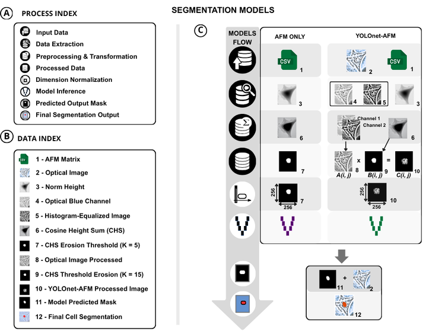
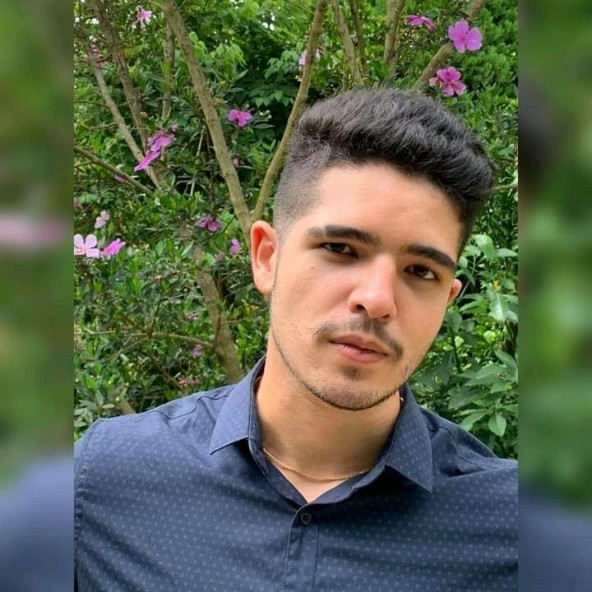
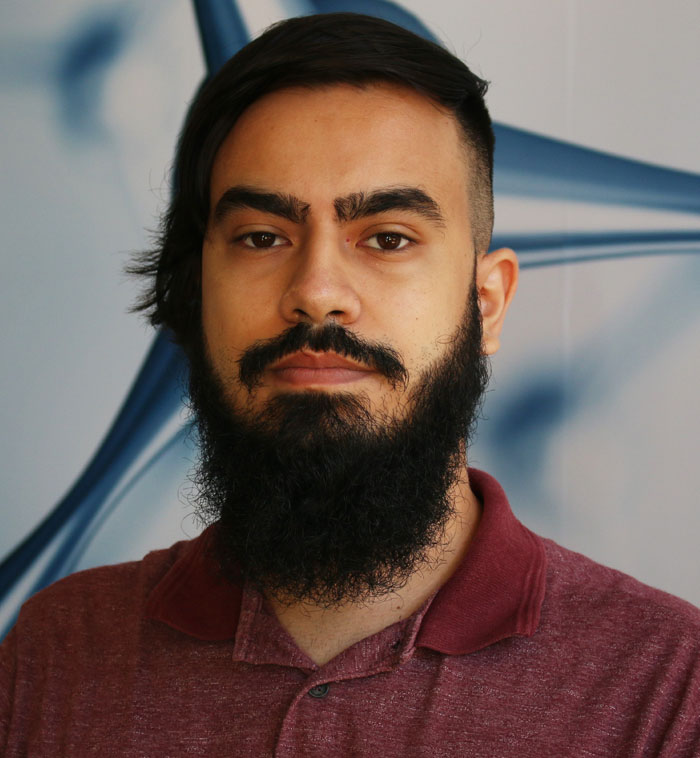
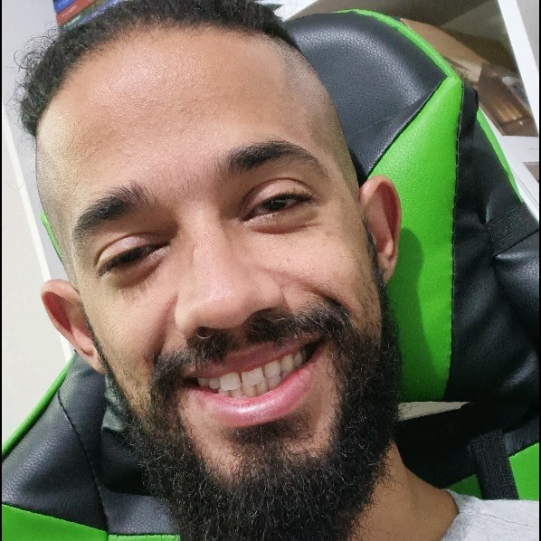

# YOLOnet-AFM: Cellular Structure Segmentation using Atomic Force Microscopy and U-Net to detect and segment nuclei structure.

This repository contains the code and models for a project focused on segmenting cellular structures, specifically nuclei, using data derived from Atomic Force Microscopy (AFM), optionally combined with optical microscopy images. The core segmentation model is based on the U-Net architecture.



*Figure: Overview of the data preprocessing and model application workflow.*

## ✨ Features

*   **AFM Data Processing:** Scripts to process raw AFM data (`.csv` files).
*   **Optical Image Integration:** Tools to crop, resize, and align optical images with AFM data.
*   **Multiple Data Modes:** Supports segmentation using:
    *   AFM data only (1 channel: CosHeightSum)
    *   Combined AFM and Optical data (2 channels)
    *   Optical data only (2 channels)
*   **U-Net Model Implementation:** Utilizes TensorFlow/Keras for the U-Net model.
*   **Prediction Pipeline:** Generates segmentation masks for input images using trained models.
*   **Performance Evaluation:** Calculates and visualizes segmentation metrics (e.g., Precision, Recall and Dice coefficient).
*   **Dockerized Environment:** Ensures reproducibility and simplifies dependency management.

## 📋 Table of Contents

*   [Hardware Prerequisites](#️-hardware-prerequisites)
*   [Software Requirements](#-software-requirements)
*   [Installation & Setup](#-installation--setup)
*   [Usage](#️-usage)
*   [Project Structure](#-folder-structure)
*   [Script Details](#-script-details)
*   [Built With](#️-built-with)
*   [Contributing](#-contributing)
*   [Authors](#️-authors)
*   [Acknowledgments](#-acknowledgments)

## ⚙️ Hardware Prerequisites

Ensure your system meets the following minimum recommendations for optimal performance:

*   **RAM:** 32 GB+ (More recommended for training with larger datasets/models)
*   **Processor:** 64-bit multicore CPU (e.g., Intel Core i5-10400 or equivalent/better)
*   **Graphics:**
    *   *Recommended:* NVIDIA GPU with CUDA support for accelerated training/inference.
    *   *Minimum:* Integrated graphics (e.g., Intel UHD Graphics 630) should suffice for running predictions, though potentially slower.

## 💻 Software Requirements

*   **Python:** Version 3.9.19 or higher.
*   **Docker:** Required for containerized setup.

<details>
<summary>Docker Installation Guide</summary>

### 🪟 Windows

1. Install WSL:

   * [Install WSL Guide](https://docs.microsoft.com/windows/wsl/install)
2. Install Docker Desktop:

   * [Download Docker Desktop](https://www.docker.com/products/docker-desktop)
   * Create a Docker Hub account and log in.

### 🐧 Linux

* Install Docker for your distribution:

  * [Install Docker on Ubuntu](https://docs.docker.com/engine/install/ubuntu/)

> \[!TIP] To use Docker without `sudo`, run: `sudo usermod -aG docker $USER` and restart your session.

</details>

## 🚀 Installation & Setup

Follow these steps to get the project running locally using Docker:

1. **Clone the Repository:**

   ```bash
   git clone https://github.com/LGCM-OpenSource/YOLOnet-AFM.git
   ```

2. **Download the dataset and pretrained models (Zenodo)**

   Access the dataset and models on Zenodo using the DOI: [10.5281/zenodo.17609119](https://doi.org/10.5281/zenodo.17609119)
   
   After downloading, unzip the package data_YOLOnetAFM.
   Then:
   
   Rename the unzipped folder to data and place it in the project root directory.
   
   Move the models folder (also included in the Zenodo package) to the project root.
   
   Your directory structure should look like:
   ```
   YOLOnet-AFM/
   ├── data/
   ├── models/
   ├── dev/
   ├── docker
   ├── requirements.txt
   └──...
   ```
4. **Build and Start the Docker Container:**

   ```bash
   make build
   make up
   ```
> [!WARNING]
> If the make commands do not work, open the Makefile and manually execute the commands listed inside it in your terminal.

### 📚 Python Libraries

<details>
<summary>Click Here to see project libraries</summary>

> The following Python libraries are used in this project. They are automatically installed when building the Docker container via `requirements.txt`.

| Library                  | Version   | Purpose                                     |
| :----------------------- | :-------- | :------------------------------------------ |
| h5py                     | 3.11.0    | Interacting with HDF5 files (often for models) |
| kaleido                  | 0.2.1     | Saving Plotly figures as static images      |
| keras                    | 2.14.0    | High-level API for TensorFlow               |
| Keras-Preprocessing      | 1.1.2     | Data preprocessing utilities for Keras      |
| matplotlib               | 3.7.0     | Plotting and visualization                  |
| numpy                    | 1.26.4    | Fundamental package for numerical computing |
| opencv_python            | 4.5.5.64  | Computer Vision library (image processing)  |
| opencv-python-headless | 4.5.4.60  | Headless OpenCV (for servers/containers)    |
| opt-einsum               | 3.3.0     | Optimized tensor contractions (dependency)  |
| pandas                   | 1.5.3     | Data manipulation and analysis (CSV, etc.)  |
| Pillow                   | 10.1.0    | Python Imaging Library (fork)               |
| plotly                   | 5.9.0     | Interactive plotting library                |
| scikit_image             | 0.19.3    | Image processing algorithms                 |
| scikit-learn             | 1.2.1     | Machine learning tools (metrics, etc.)      |
| scipy                    | 1.10.0    | Scientific and technical computing          |
| setuptools               | 69.5.1    | Package building utilities                  |
| six                      | 1.16.0    | Python 2/3 compatibility library          |
| Tensorflow               | 2.14.0    | Deep Learning framework                     |
| Torch                    | 2.3.0     | Deep Learning framework (potentially used)  |
| tqdm                     | 4.64.1    | Progress bars for loops                     |

</details>

> [!NOTE]
> All project libraries are installed automatically within the Docker container when running `make build`.


## ▶️ Usage

* **Run the Main Script:**

  ```bash
  make run
  ```

  This will execute `main.py` inside the Docker container `YOLOnet-AFM`.

* **Monitor Logs:**

  ```bash
  make logs
  ```

* **Access a Shell in the Container:**

  ```bash
  make shell
  ```

### 🛠️ Makefile Commands

The following commands are defined in the `Makefile` to simplify your workflow:

| Command        | Description                                                     |
| -------------- | --------------------------------------------------------------- |
| `make build`   | Builds the Docker image defined in `docker/docker-compose.yml`  |
| `make up`      | Starts the containers in detached mode (`-d`)                   |
| `make down`    | Stops and removes the containers                                |
| `make restart` | Restarts the environment (equivalent to `make down && make up`) |
| `make logs`    | Displays the logs of the `yolonet_afm` service                  |
| `make shell`   | Opens an interactive terminal inside the container              |
| `make run`     | Executes the `main.py` script inside the container              |
| `make clean`   | Removes unused Docker images and volumes (frees up disk space)  |


### 🔄 Workflow Options

1. **Select the Model Pipeline**
  The script will prompt you to select an option:

      * **Option 1:** Select the **AFM-Only** model pipeline
      * **Option 2:** Select the **YOLOnet-AFM** model pipeline
      * **Option 3:** Select the **OptiCon-PC** model pipeline

> [!TIP]
> Each pipeline loads the corresponding configuration and prepares the appropriate input channels.

2. **Choose How to Execute the Pipeline**
   After choosing the model type, the script provides two execution options:

   * **Option 1** — `Train a new model`

      The full training pipeline will run, including preprocessing, dataset assembly, training, and generation of predictions.

   * **Option 2** — `Use our pre-trained model`

      The script will load the pre-trained weights available in the models/ folder and run only inference, generating segmentation masks without retraining.


### Output

Regardless of the selected path, the workflow will generate results in:

```bash
data/output/<model-selected>/
```

Where `<model-selected>` corresponds to one of:

* `unet_afm_1_channels_only_AFM_CosHeightSum/`

* `unet_afm_2_channels_like_yolo_opt_afm/`

* `unet_afm_2_channels_only_optical/`


## 📁 Folder Structure

<details>
<summary>Click to show </summary>

```
├── datasets
├── input
│   ├── optical_images_resized
│   ├── train
│   │   ├── train_1_channels_only_AFM_CosHeightSum
│   │   │   ├── msk_img_training
│   │   │   └── opt_img_training
│   │   ├── train_2_channels_like_yolo_opt_afm
│   │   │   ├── msk_img_training
│   │   │   └── opt_img_training
│   │   └── train_2_channels_only_optical
│   │       ├── msk_img_training
│   │       └── opt_img_training
│   └── Usefull_data
├── intermediate
│   ├── pre_processing_afm
│   │   ├── image
│   │   └── mask
│   ├── pre_processing_optico
│   │   ├── image
│   │   └── mask
│   └── pre_processing_optico_and_afm
│       ├── image
│       └── mask
├── output
│   ├── unet_afm_1_channels_only_AFM_CosHeightSum
│   │   └── predicts
│   ├── unet_afm_2_channels_like_yolo_opt_afm
│   │   └── predicts
│   └── unet_afm_2_channels_only_optical
│       └── predicts
└── raw
    ├── bw_images
    ├── optical_images
    └── txt_files

```

</details>


## 📜 Script Details

<details>
<summary>Click to expand script descriptions</summary>

---

### :scissors: `1_cropping_opt_images.py`

*   **Purpose:** Aligns optical images with AFM data by cropping the region of interest and resizing.
*   **Input:**
    *   `data/raw/optical_images/`
    *   `data/raw/bw_images/` (Likely ground truth masks used for alignment/reference)
    *   `data/raw/txt_files/` (AFM data files, potentially for coordinates)
*   **Output:**
    *   `data/input/optical_images_resized/`

---

### :open_file_folder: `2_preprocess_unet.py`

*   **Purpose:** Prepares the final input tensors for the U-Net model by combining/formatting optical and/or AFM data channels as required for each specific model type. Also prepares corresponding masks.
*   **Input:**
    *   `data/input/optical_images_resized/`
    *   `data/input/Usefull_data/` (Supporting AFM info)
    *   Raw data sources as needed (`data/raw/`)
*   **Output (Example for Combined):**
    *   `data/intermediate/pre_processing_optico_and_afm/image/`
    *   `data/intermediate/pre_processing_optico_and_afm/mask/`
    *   *(Similar outputs created in `pre_processing_afm` and `pre_processing_optico` directories depending on execution)*

---

### :dart: `3_predicts.py`

*   **Purpose:** Loads a pre-trained model and generates segmentation predictions on a specified preprocessed dataset.
*   **Input:**
    *   Preprocessed images: `data/intermediate/pre_processing_<model-selected>/image/`
    *   Trained model file: `models/<model_file_name>`
*   **Output:**
    *   Predicted masks: `data/output/<model-selected>/predicts/`

---

### :bar_chart: `4_eval_models.py`

*   **Purpose:** Compares predicted segmentation masks against ground truth masks to evaluate model performance.
*   **Input:**
    *   Predicted masks: `data/output/<model-selected>/predicts/`
    *   Ground truth masks: `data/intermediate/pre_processing_<model-selected>/mask/`
*   **Output:**
    *   Metrics visualization: `data/output/<model-selected>/model_metrics.png`
    *   (Potentially) Text files or logs with detailed metrics.

---
</details>


## 🛠️ Built With

*   **Languages:** Python
*   **Frameworks:** TensorFlow, Keras, PyTorch
*   **Libraries:** OpenCV, Scikit-Image, Scikit-Learn, Pandas, NumPy, Matplotlib, Plotly
*   **Tools:** Docker, Git
*   **Editors/Management:** Visual Studio Code, Notion (Task Management)

## 🤝 Contributing

Contributions are welcome! If you'd like to contribute, please follow these steps:

1.  Fork the repository.
2.  Create a new branch (`git checkout -b feature/YourFeatureName`).
3.  Make your changes.
4.  Commit your changes (`git commit -m 'Add some feature'`).
5.  Push to the branch (`git push origin feature/YourFeatureName`).
6.  Open a Pull Request.

Please ensure your code adheres to existing style conventions and includes relevant tests if applicable.

<!-- ## 📄 License

This project is licensed under the [NAME OF LICENSE - e.g., MIT License] - see the `LICENSE` file (if available) for details.
*(If no LICENSE file exists, consider adding one, e.g., MIT, Apache 2.0)* -->

## ✒️ Authors

<table align="center" style="border: none; background: none;">
  <tr style="border: none; background: none;">
    <td align="center" style="border: none; background: none;">
      <a href="https://github.com/ArtRocha">
        <br>
        <sub>
          <b style="font-size:16px"> Arthur Rocha </b>
        </sub>
      </a>
    </td>
    <td align="center" style="border: none; background: none;">
         <a href="http://lattes.cnpq.br/8207473893996045">
           <br>
           <sub>
             <b style="font-size:16px"> Ayumi Aurea Miyakawa </b><br>
           </sub>
         </a>
       </td>
        <td align="center" style="border: none; background: none;">
      <a href="http://lattes.cnpq.br/0399495551887391">
        <br>
        <sub>
          <b style="font-size:16px"> Cleyton Biffe </b><br>
        </sub>
      </a>
    </td>
    <td align="center" style="border: none; background: none;">
      <a href="https://github.com/EdCarlos-dev">
        <br>
        <sub>
          <b style="font-size:16px"> Ed Santos e Silva </b><br>
        </sub>
      </a>
    </td>
     <td align="center" style="border: none; background: none;">
      <a href="http://lattes.cnpq.br/9674023945962136">
        <br>
        <sub>
          <b style="font-size:16px"> Jose Patane </b><br>
        </sub>
      </a>
    </td>
  </tr>
</table>

## 🙏 Acknowledgments

<div align="center">
 

 © Todos os direitos reservados, 2025 - Instituto do Coração (InCor) HCFMUSP
</div>

